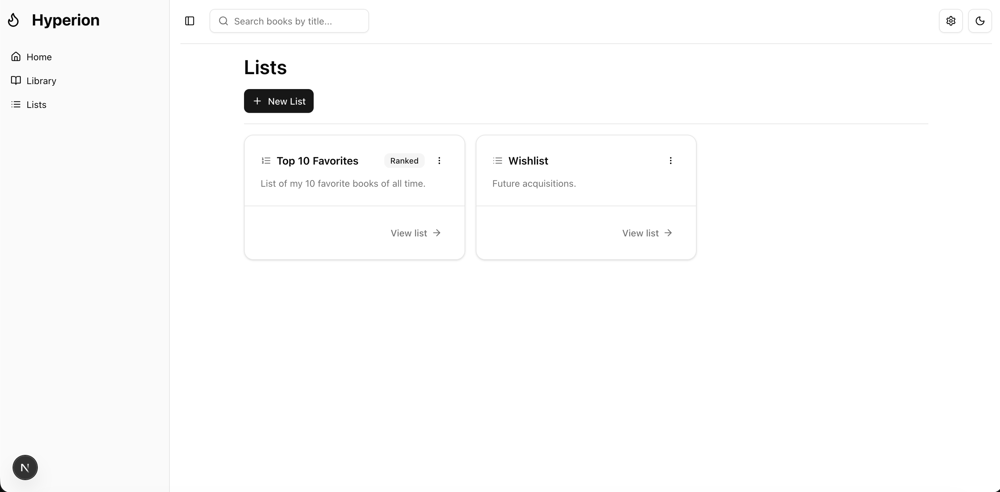

# Hyperion
## Backend
### Details
Hyperion is designed to be used both on and offline.  This means that all book data can be input manually, and fetching the details automatically by title or isbn relies on a third party service.  If you want to enable this functionality, it will be necessary to setup the API as directed below (See **Data Sources**).

Book data is pulled from a third party service, namely **HardcoverAPI**.  Additional sources (such as OpenLibraryAPI) might be planned for future releases.

All data is cached in a Postgresql database, therefore, as searches are completed the cache will grow.  This method reduces queries to third party APIs and allows for faster retrieval times.  

## Guide
### Running the Application
Development is currently active and instructions will be updated as work progresses.

### Data Sources
Some configuration is required in order to fetch book data from the internet.  In order to use Hardcover API you must have a valid Hardcover account, then follow these instructions to retrieve your API Key ([Guide](https://hardcover.app/account/api)).

Copy your API key, including the `Bearer` portion, and paste it into the Hardcover input on the data sources dialog.  Click save and you're good to go!

## Examples
### Home

### Library

### Add Book

### Quick Add

### Lists

