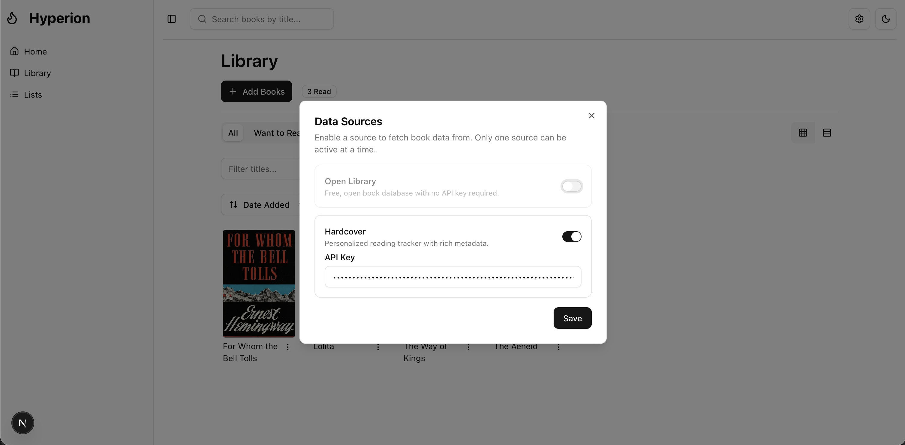
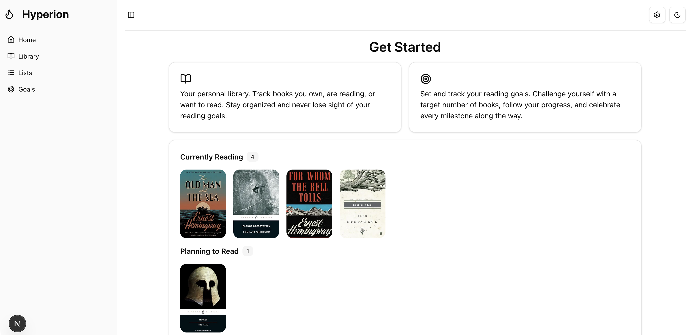
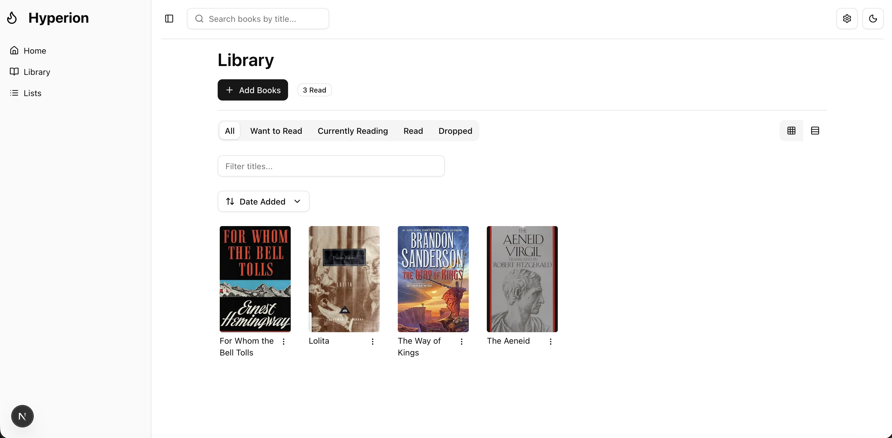
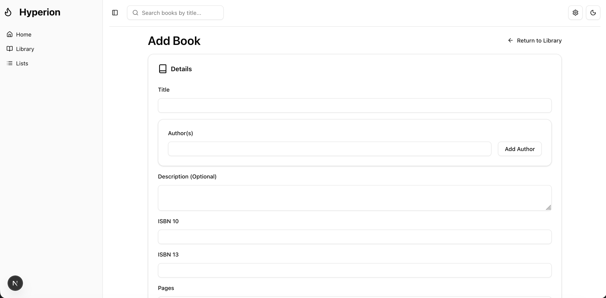
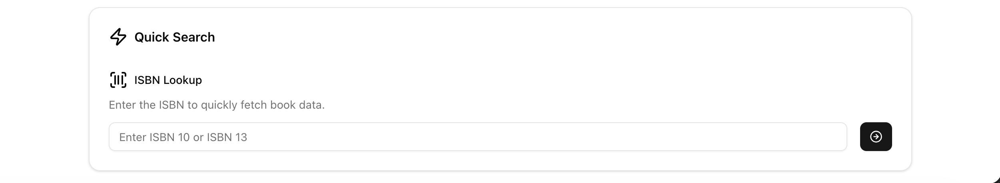

# Hyperion
## Backend
### Details
Book data is pulled from multiple third party services, namely the **Hardcover** and **OpenLibrary** APIs.  These data sources can be configured by the user from the web interface.

All data is cached in a Postgresql database, therefore, as searches are completed the cache will grow.  This method reduces queries to third party APIs and allows for faster retrieval times.  

## Guide
### Data Sources
OpenLibrary is the default data source as it is free-to-use and doesn't require an API key.  However, it has some limitations compared to Hardcover API, which provides richer data.  In order to use Hardcover API you must have a valid Hardcover account, then follow these instructions to retrieve your API Key ([Guide](https://hardcover.app/account/api)).

Copy your API key, including the `Bearer` portion, and paste it into the Hardcover input on the data sources dialog.  Click save and you're good to go!

## Examples
### Home

### Library

### Add Book

### Quick Add

