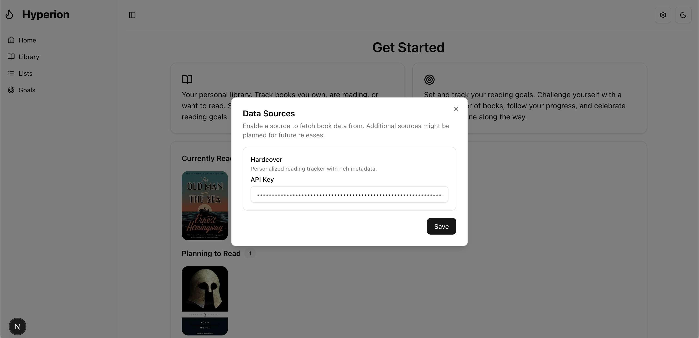
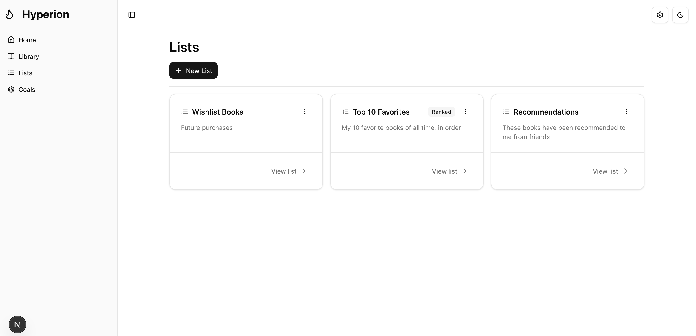
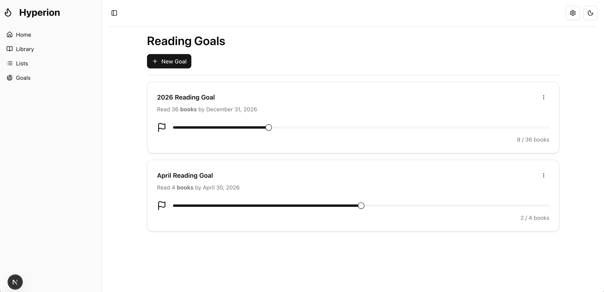

# Hyperion
## About
### Introduction
Hyperion is a lightweight self-hosted web application for managing a personal library.  The application is designed to be used both on and offline.  This means that all book data can be input manually, and fetching the details automatically by title or isbn relies on a third party service.  If you want to enable this functionality, it will be necessary to setup the API as directed below (See [Data Sources](#data-sources)).

### Features
- Save books to your library.
- Track the reading status of your books (See what you're currently reading, would like to read, etc.).
- Create reading lists to logically sort items in your library.
- Set goals for yourself to keep track of your reading progress and gain extra motivation.

### Technologies
<p align="center">
  
  
  
  
</p>

## Backend
### Details
Hyperion is designed to be used both on and offline.  This means that all book data can be input manually, and fetching the details automatically by title or isbn relies on a third party service.  If you want to enable this functionality, it will be necessary to setup the API as directed below (See **Data Sources**).

Book data is pulled from a third party service, namely **HardcoverAPI**.  Additional sources (such as OpenLibraryAPI) might be planned for future releases.

All data is cached in a Postgresql database, therefore, as searches are completed the cache will grow.  This method reduces queries to third party APIs and allows for faster retrieval times.  

## Guide
### Running the Application
Ensure that docker is installed on your machine.

Navigate to the `hyperion` directory, and then run 
```
sudo docker compose up --build
```

Once the application is running, you can access it at `localhost:3000`

### Data Sources
Some configuration is required in order to fetch book data from the internet.  In order to use Hardcover API you must have a valid Hardcover account, then follow these instructions to retrieve your API Key ([Guide](https://hardcover.app/account/api)).



Copy your API key, including the `Bearer` portion, and paste it into the Hardcover input on the data sources dialog.  Click save and you're good to go!

## Examples
### Home


### Library


### Lists


### Goals



