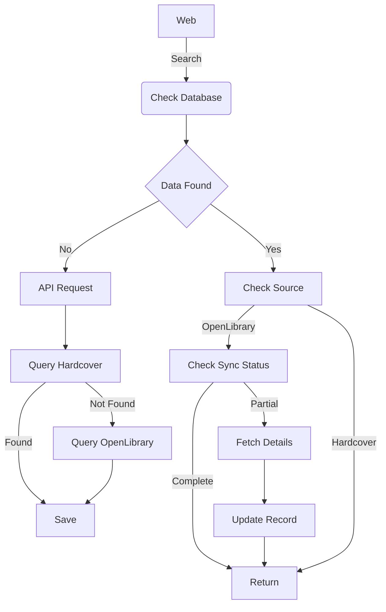

# Hyperion
## Backend
### Details
Book data is pulled from multiple third party services, namely the **Hardcover** and **OpenLibrary** APIs.  Hardcover is utilized as the primary data source, and will be queried first.  OpenLibrary is the backup and is used in combination with the former to populate search results.

All data is cached in a Postgresql database, therefore, as searches are completed the cache will grow.  This method reduces queries to third party APIs and allows for faster retrieval times.  

### Program Flow

